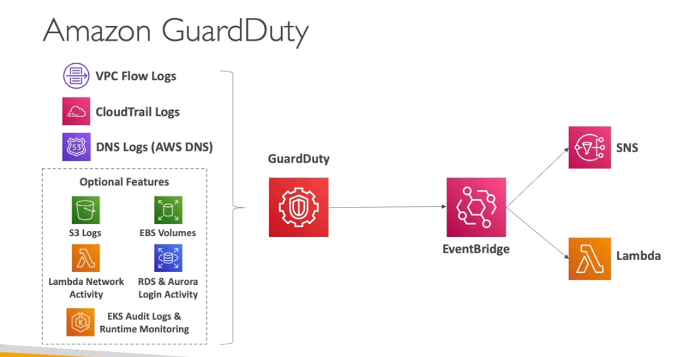

Guard Duty

- Intelligent Threat discovery to protect your aws account
- Use machine learnig algo
- Input data includes
    - Cloudtrail events logs
        - Managment events
        - S3 data events
    - VPC flow logs
    - DNS logs
    - EKS audio logs
- Can setup event bridge rules if there are any findings
- its good for cryptocurrently attacts

Guard Duty Advanced

- Multiple accounts
- delegated admins, memeber account can become admin of guard duty
- findings potential security issues
- we can seend alerts using event bridge
- guardduty pull independace data
- you don't have to enable the data guarddduty will take data automatically

Findings types
    - There are different types of the findings ec2, eks, s3

