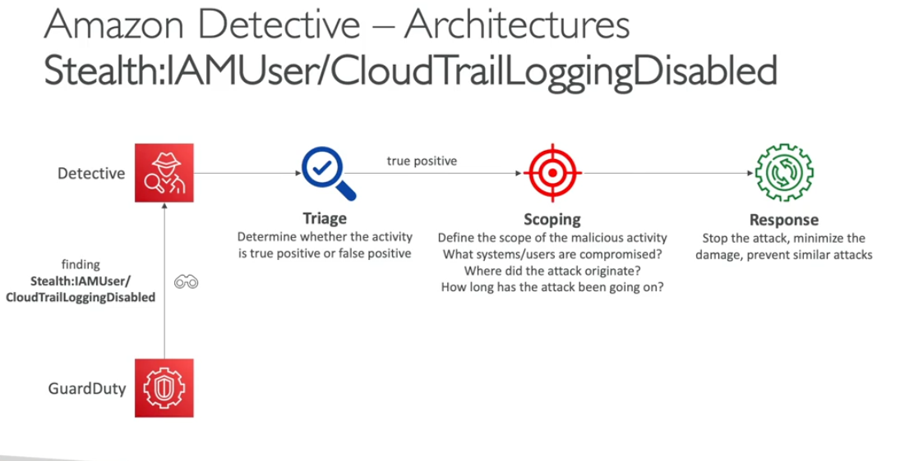

Detective
- once we have any security findings
- dective will analyzes, investigates, and quickly identifies find the root cause this issue using ML
- autommatically collects and process events from vpc flow logs, cloudtrail, guardduty and create a unified view
- Produces visualization with etails and context to get to the root cause

Architecture

