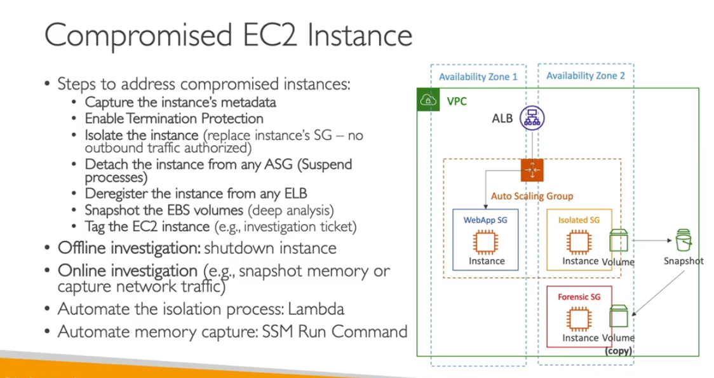
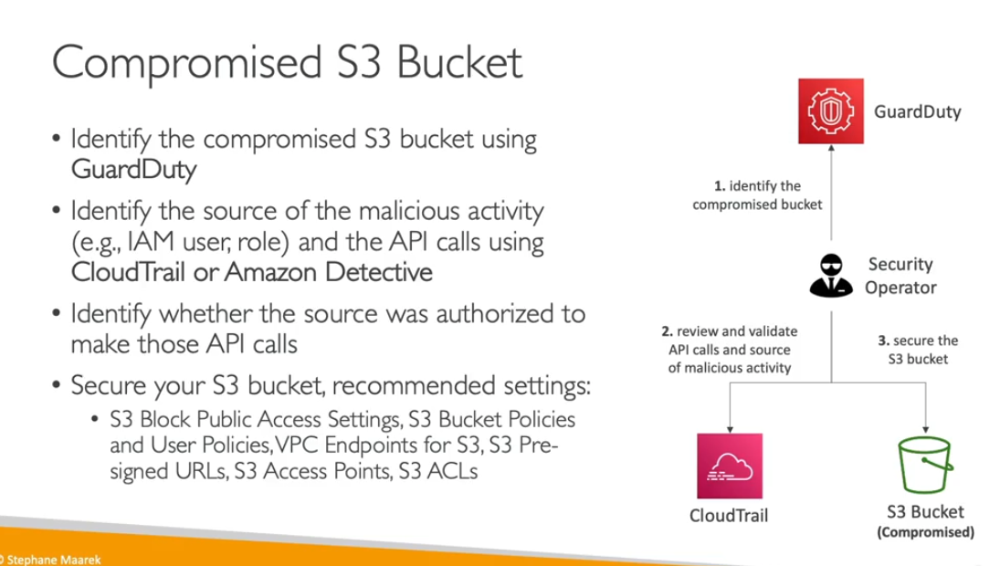
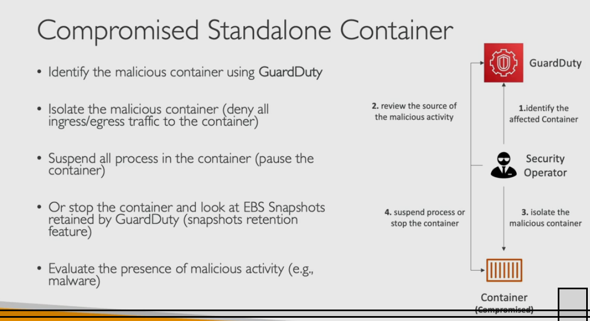

lets suppose what todo with compromise

-

ECS cluster
- which clsuter
- source of the attach
- deny all the iggress/outbound
- look for snapshot data
- fornics analysis
-

- RDS
    - if this is not legimate bahaviour
    - stop the acceess if the euseer
    - check the source
    - chek any leak data
    - usee IAM to access the database

    

    

    