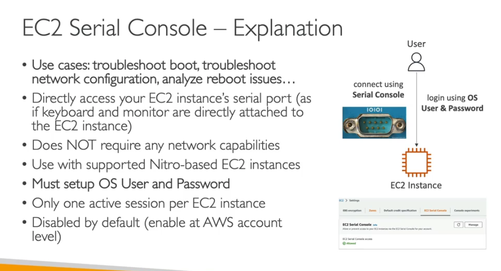

- this is disabled by default in your account
- troubleshoot boot, network, analyse reboot issues
- you can directly access your ec2 instance via serial port if the keyboard and monitor are the directly attahced to ec2 instance
- doesnt not require any network
- must setup username and password
- only 1 active session per ec2 instance

