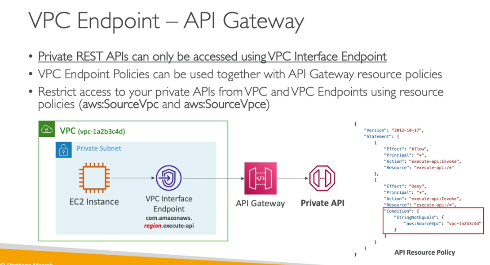

- VPC endpoints use to connect privaily to aws services
- vpc endpoint gateway for s3 and dynamodb
- endpoint interface is a eni except for dynamo db
- create one gateway for one vpc
- you must define routetable
- must make sure DNS resolution enable for that vpc
- vpc gateway cannot extend to your outside your vpc,
- you need to create each vpc

- VPC endpoint interface
    - preevision eni that will have private endpoint interface host name
    - levergae the security group
    - private dns
    - these can be accessible outside the vpc like on vpn on-premise

- VPC Endpoint Policies
    - Can attached to gateway or interface
    - doesnt overwrite the identity base policy or IAM base policy
    - can restric specfic api call on specfic resouces
    - who can access our buckeet privatly, mean you can restric only your org can use private vpc
    - you can restric the servixe to use only vpc endpoint
    - in endpoint side you can add accountid to allow only
    - resouce base policy still protects if the vpce allowed

All the VPC Endpoints

