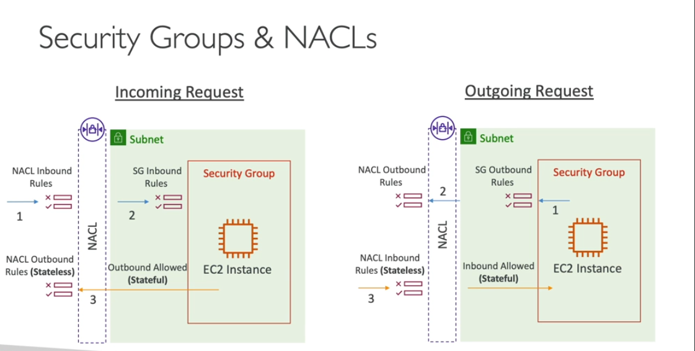
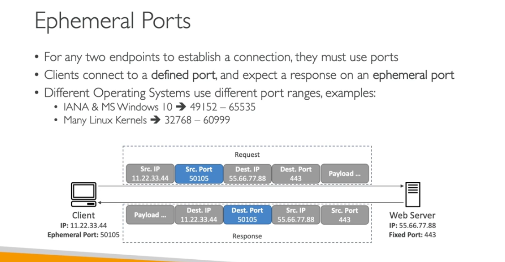
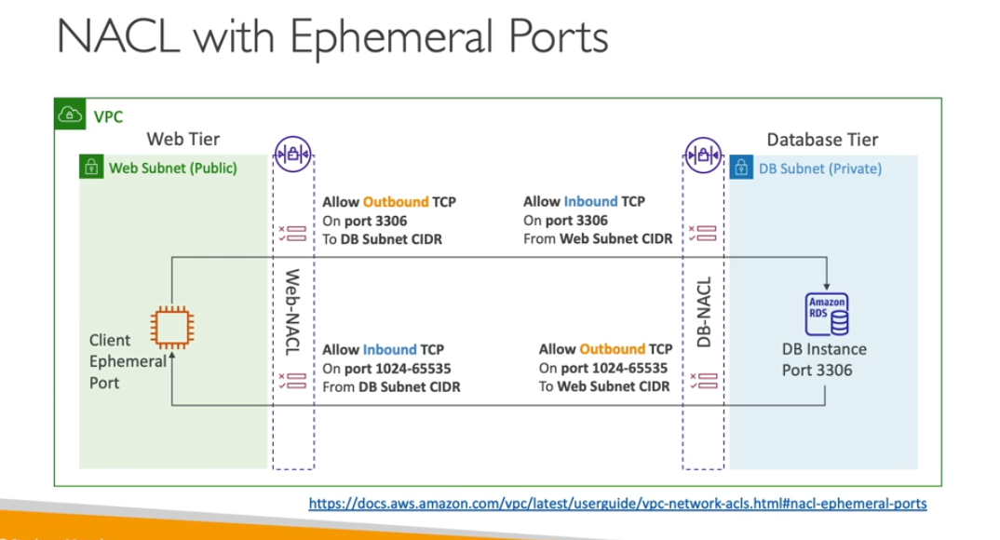

- NACL is stateless
    - each subnet have one nacl
    - lower will be higer preceedence
    - they are greate blocking ip on subnet level
    - default NACL allow everything inbound/outbount
    - rules no are very important

- security group are satefull
-

- Ephemeral Ports
    - to establish the connection with in/out with client and server

- Security Groupt outbound
    - by default its allowe to all
- Prefix List
    - you can define set up ciddr
    - you can share with other account or
- Use aws maange prefix
    - you cant create delte
    - these are aws ips

- Extras
    - if you changed the rules it will never distrupt existing connections
    - if ssh open and rule moved but connectio still open
    - NACl allow you block the connection immedialy
    - 