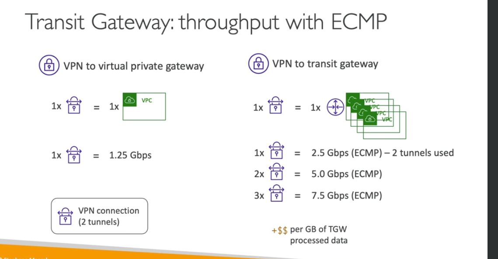
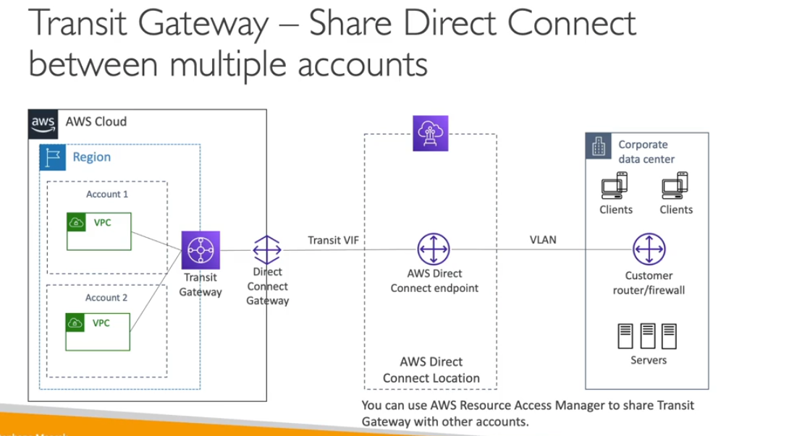

- if you have many vpc you need to connect all together you need to use transit gateway
- transit peering connection
- you can connect multiple vpc or onpremise ddata center
- you need to create route table who to connect which
- this is the only service IP multicast
- its to increase the transt gateeay bandwidth
- there two tunnel use when you use transit gateway you need to two
- i fyou crate site to site vpn you have four tunnel
- one for forward or one for backwards.
- you can share with multiple accounts

