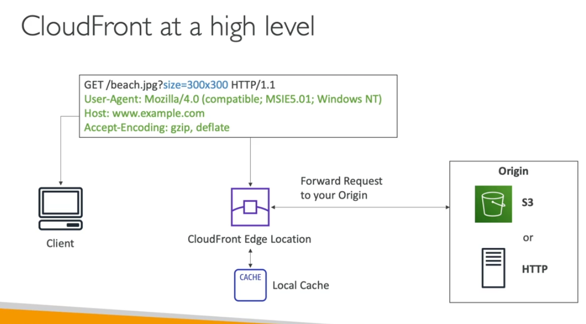
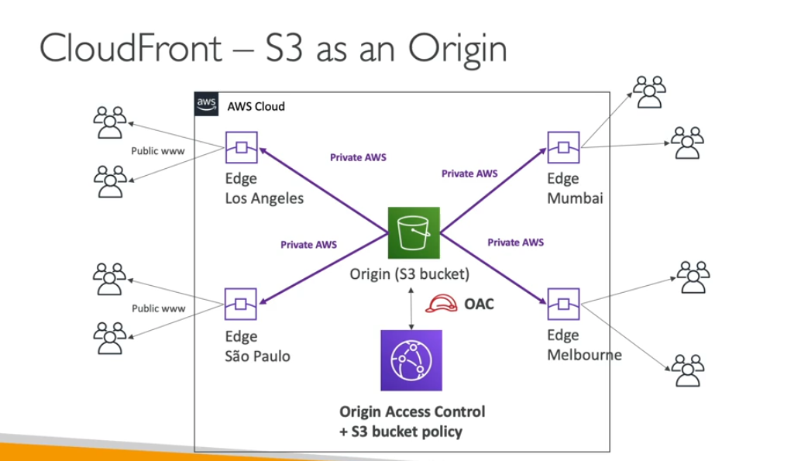
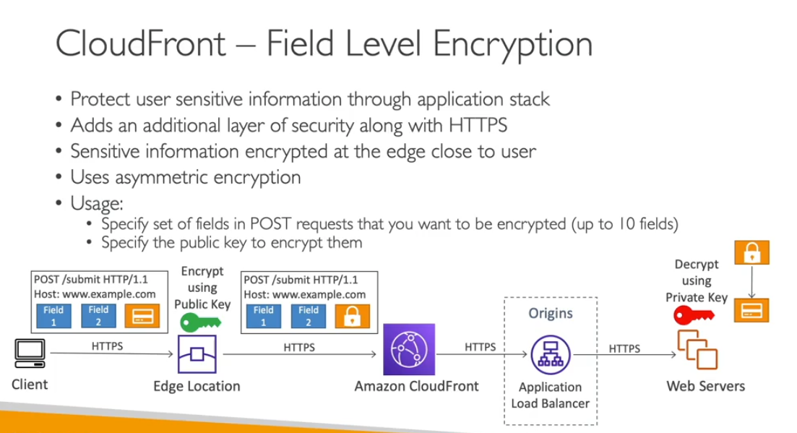
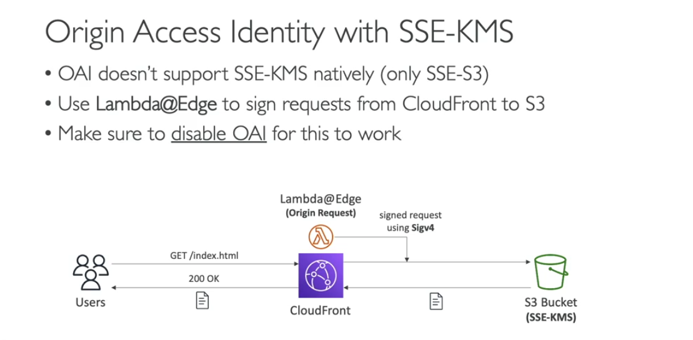
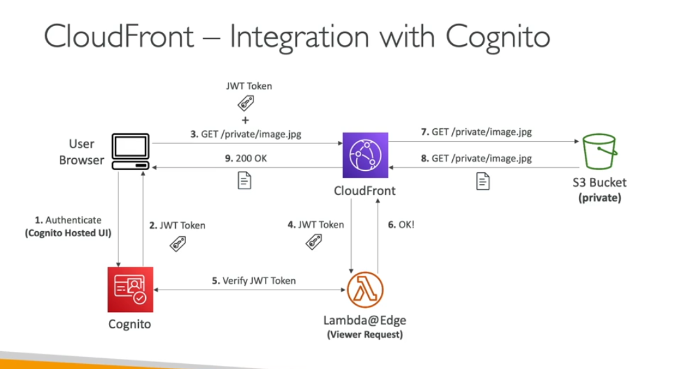

Cloudfront

- its content delivery network liek CDN
- your content cache all around the world
- DDos protection we will get it also using something sheild WAF
- orgin like s3
    - origin access control only access to s3
    - cloudfront can be use as ingress
- ec2, any http

- Cloudfront vs S3
    - you have edge location
    - files are catche for ttl
    - great for static website

- S3
    - replication entire bucket to another region
    - great for dynamic content

- Cloudfront GeoLocaiton
    - you can allow the country list
    - you can block the list country

- Cloudfront - Singed urls
    - you need to attach the policy when the url will be expire
    - singed url is only for single file
    - cookies for many files to use
    - object can be acceess only from cloudfront

- Cloudfront singed urls vs S3 pre-singled urls
    - allow access to path
    - filter by ip , path date expire
    - can leverage the cache features
    - issue a request as the person who presignt the url
    - use IAM key of the signing IAM principal
    - limited lifetime

- You can create public key and private key in root accoutn level for cloudfront as old method
- now you can create public key in cloudfront so we need to use that only

- Field Level Encryption
    - you can encrypt the field while request to clouffornt
    - like credit card information

- Authorization header
    - you neeed to forward this to ec2 instances
    - no support for s3 but for everythings.
- Customer header
    - ALB can filter the custom header if the customer header doesnto present you can reject the request

Integration with Cognito

