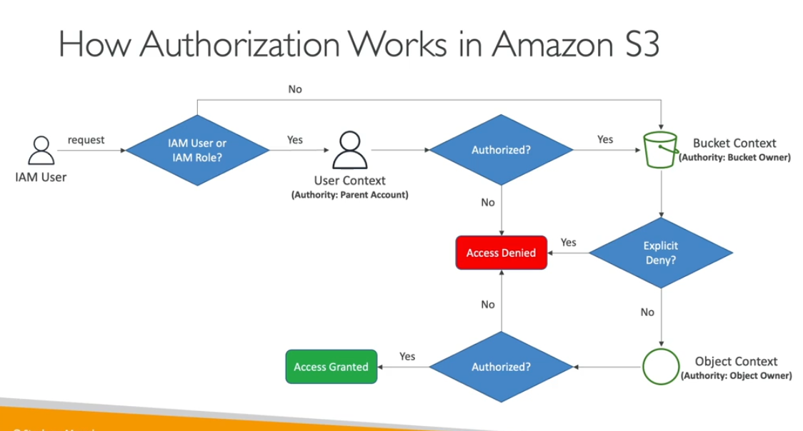

- Is IAM authorise the parents polcy
- if the parent own the bucket or object, than bucket policy/ACL or ojbect acl is evalueated
- if the parent own the bucket/objects it grant the permission to its IAM principlasl using IAM or resouce based policy

- ACL should be disabled by default if you are not managing the each user ACL
- if other bucket user write the data to the bucket the owner not abl to access means ACL was enabled

- You can denied to use S3 http by implement the asw:securetransport
- restrict by public IP address (aws:sourceip)
- restrick by user id (aws:userid ) tag
