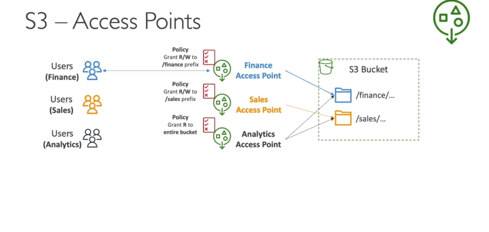

- We can create access points instead creating the ACL or adding policies to specfic paths
- security management for s3 bucket
- access points has its own DNS name (internet origin or vpc origin )
- an access point polic (simirlar to bucket policy) - manage security at scale

- You can create access point for specfic foler and allow to access
- you can restric the bucket to access only from access points
