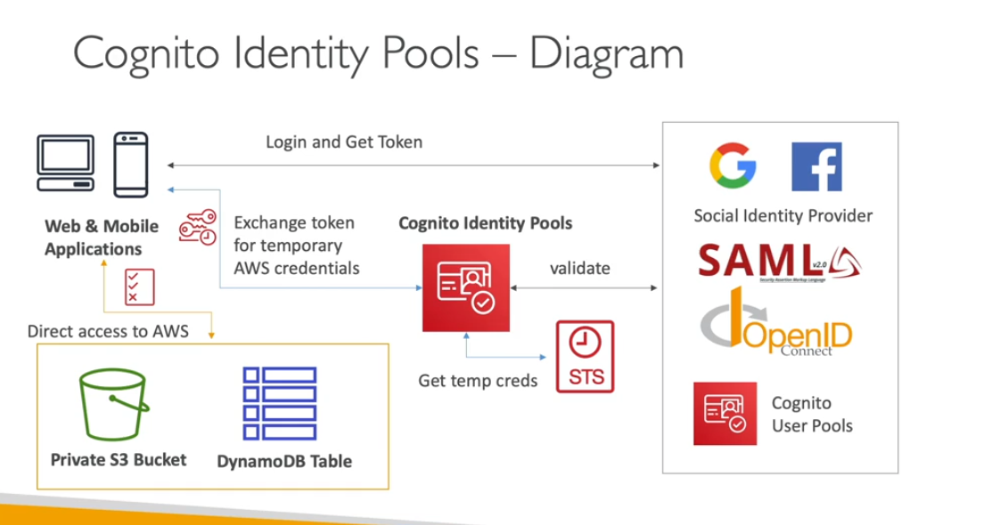

- Users are outside they need access our services
- we can give access aws services using cognito identity pool
- public providers (login with amazon, facebook, google, apple)
- OpenID

- we can define the rule for the users
- We can allow the userid of the conginit (cognito-identidy.amazon.com:sub/*)