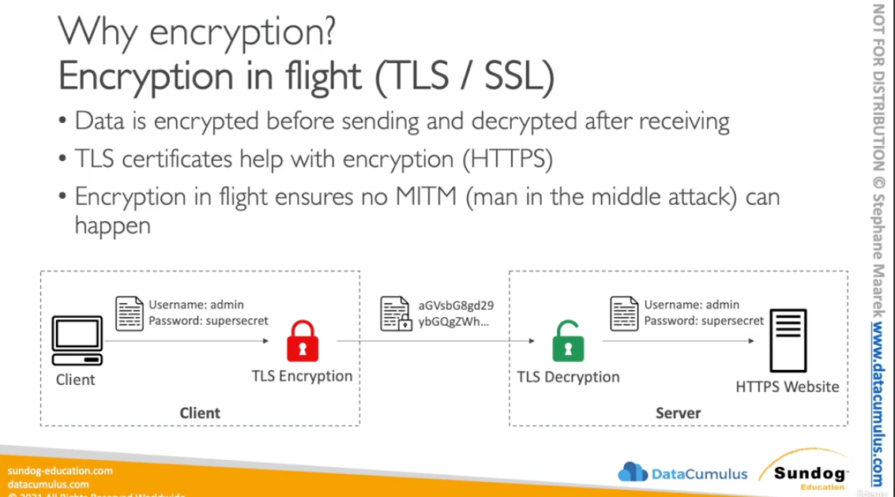

- Encryption in flight
- TLS : data will be encrypted inflight
- we want to be data in protected
- we dont; want to be man in the middle attack can happen

- Serverside encrypted at rest
    - data encrypted at rest
    - data decrypte before send

- Client Side encryption
    - data encrytped by client and store in encrypted format
    - data descrypted by client when received

