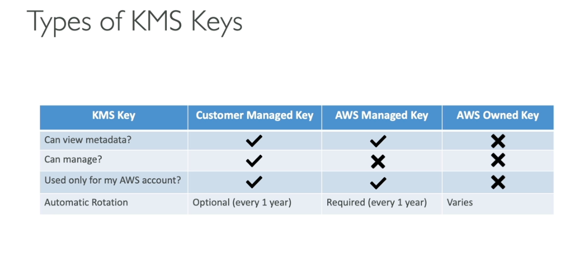
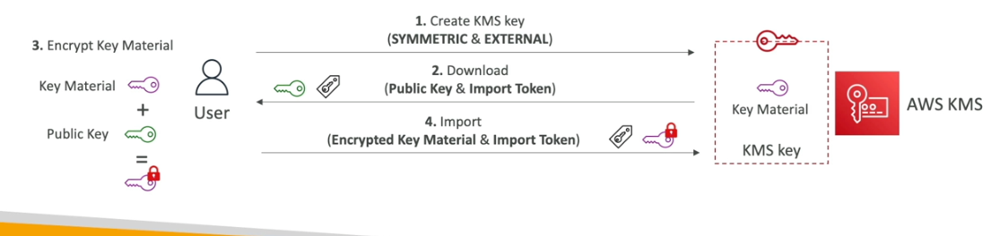

AWS KMS (key management service)

- easily control access data
- seemless integration with all the aws servcies
- we can use cli

- two type kesys
    - symmetrics
        - single key to use encrypted and decrypted
    - asymmetics
        - public key and private
        - public key to encrypt
        - private key to decrypt
        - once the data encypted with public key only the private key can be decrytped the data
- Customer managed keys
    - create and mange
    - possibe rotations
    - can add a policy
    - leverage the encryption
- AWS managed keys
    - automatically rotation by aws
    - manage by aws
    - view key policy and audit in cloudtrai
- AWS owned keys
    - created and manage by aws
    - used in multiple aws accounts but they are not in your aws account
    - you can view and use track and audit it

- KMS Key Material origin
    - identify the source of the key meterial
    - cant change after creation
    - AWS_KMS
        - AWS KMS creates and manages the key material in its own key storee
    - External
        - You import the key material into the KMS key
        - you are respontl for secoure and manag theis key material outside the aws
    - Custom key store manage your material in cloudhsm

- Keys live in your HSM cluster the KMS using it

- External Keys in KMS

