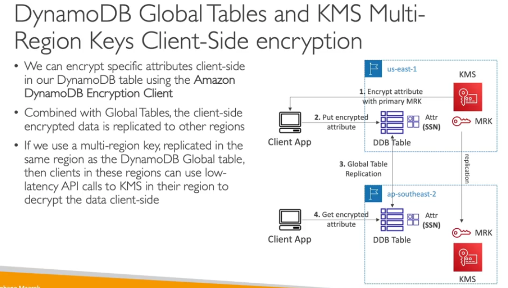

- Key you are replicate to other regions
- same key other region and key id will be remain same
- Use Case:
    - you can encrpt in one region and decrypt to another region
    - no need to decryptd  to move data anaother region
- its not recommanded to use multi regions but there are some use cases

