- Encrypt the API using KMS key
- and decrypt with kms

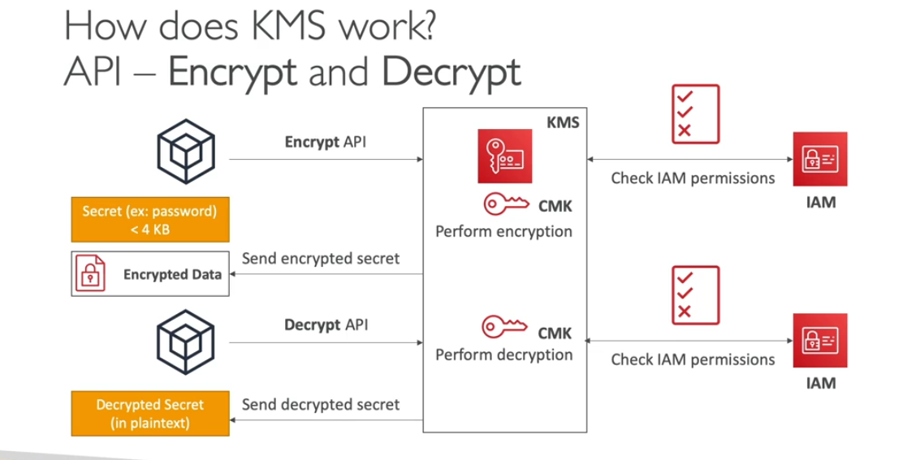

- anything 4KB data you need to envelope encryption techniqueu
- we will use GenerateDataKey
- send back to CMK data file and encorypted key
- if we want to decrypt the key we will request to decryp key and than decrypt the data file using the plain text

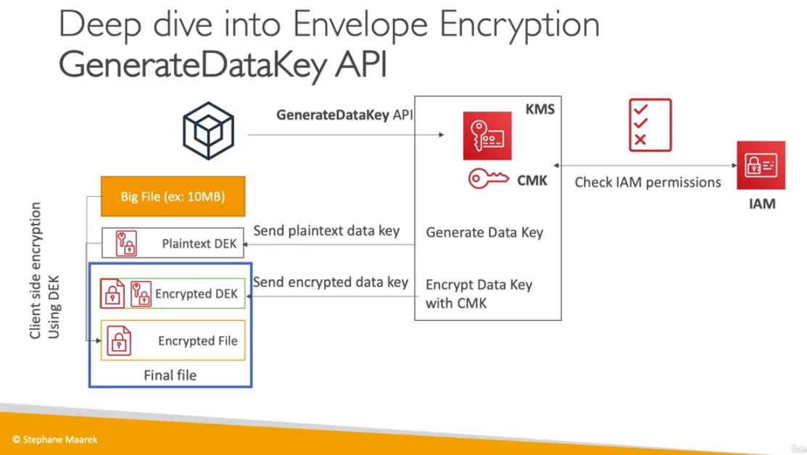

- KMS Key rotation
    - you can do key rotation customer manaer key not aws managed key
    - every 1 year it will be happen
    - but you can manul rotate the key for 90 or 180 days as per requirments

- KMS Key Deletion
    - you cannot delete key immdiate you need to use 7 to 30 days
    - you can take action while deleting the key if somebody request to delete the key you can track using cloudtrail, cloudwatch logs
    - you can trigger eventbride to send the notification
    - you can apply remidiate the action by using system manager
    - you can delete the multi-region key, first you need to delete the replica of the key than you can delete the primary key
    - if you want to keep replica key you can promote that key to primary key and than use it

- KMS Key Policies & Deep dive
    - if you dont setup kms keys policy you cannot access key
    - if you dont setup s3 policy you can access th bucket
    - you can define who can access the key
    - KMS administrator manage the key
    - User can authorise the keys to use it

- KMS Key Grants
    - this will allow to use keys from other account
    - often use for temp uses
    - once grant provided you need to delte manul
    - grant perform the operation as describe in IAM policy
    - you can use AWS cli only to grant
    - AWS key grant all the time

- KMS Condition Keys (in the policy )
    - kms:viaservice : only used by aws service
    - ksm:calleraccount: only allow to specfic account

- KMS Key policy Evaluation

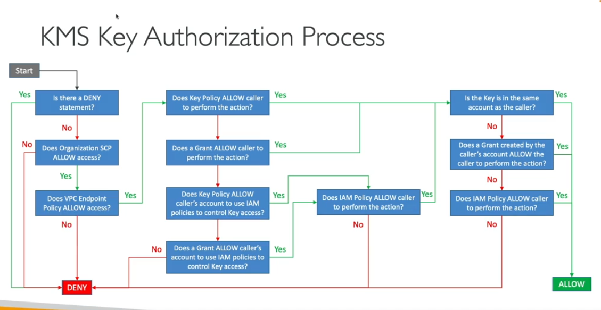

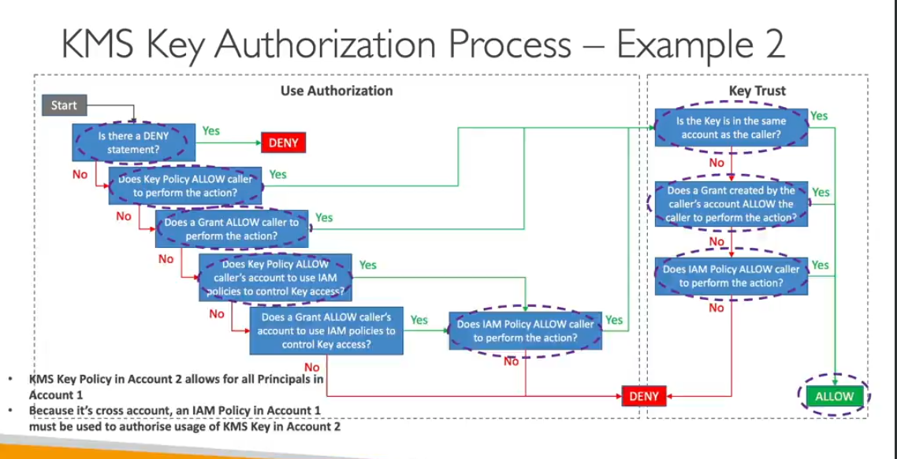

- KMS Cross account access
    - create grants other account to use the kms key

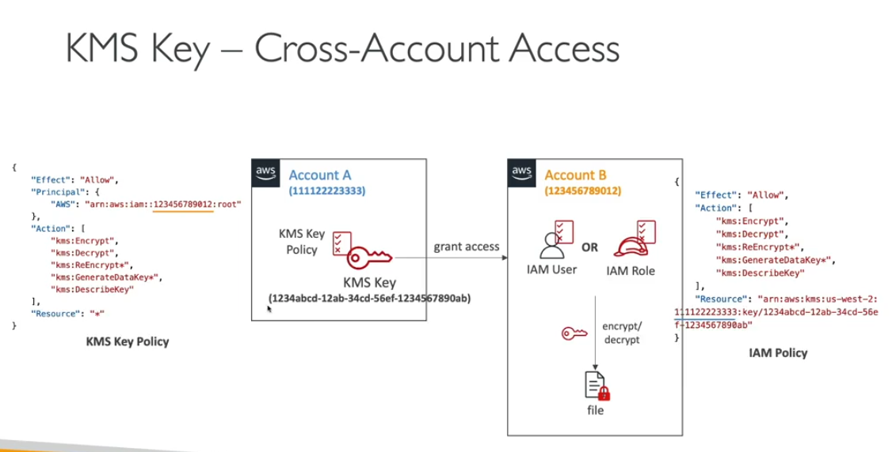

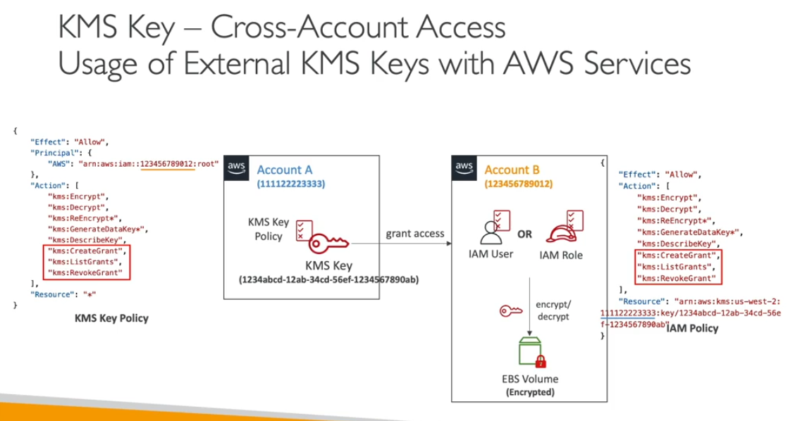

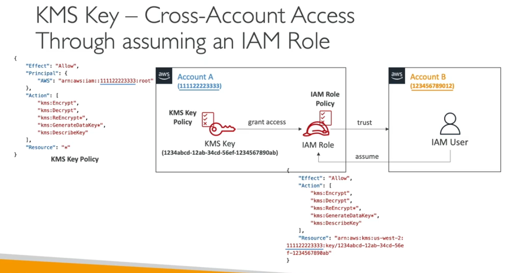

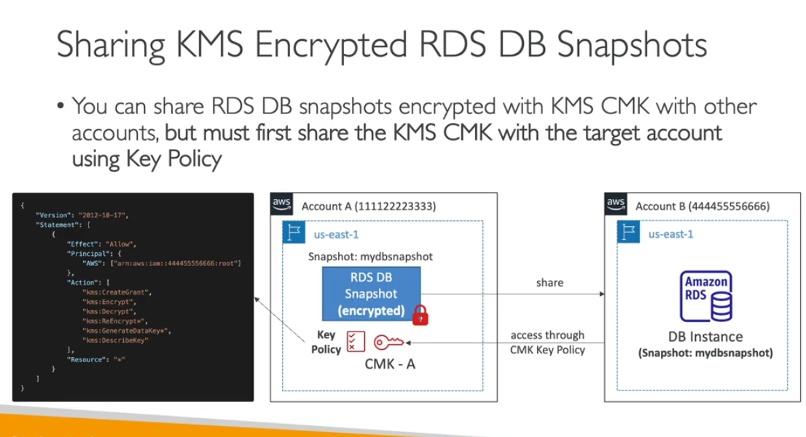

- KMS Asymmetrics Encryption
    - We have public and private key encrypt and decrtypt data
    - Digital sign also possible with you

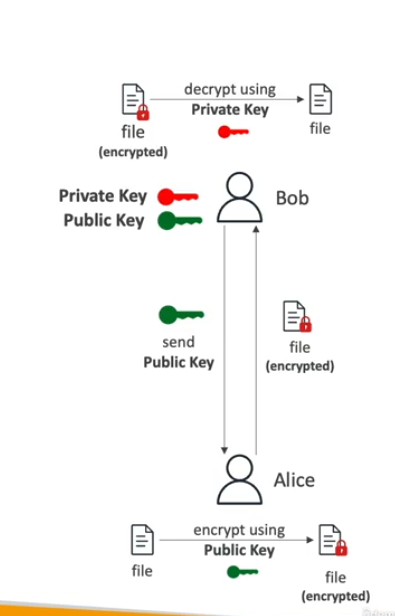

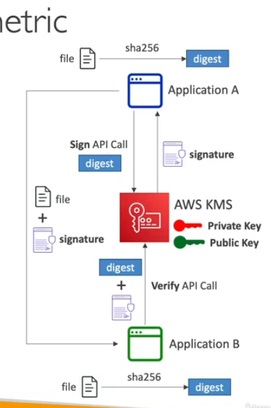

- KMS API Calls limits and Data key Caching
    - Data key caching means keep the file in the applciation to encrypt the data, this will reduce the calls
    - its implemented in som SDKs

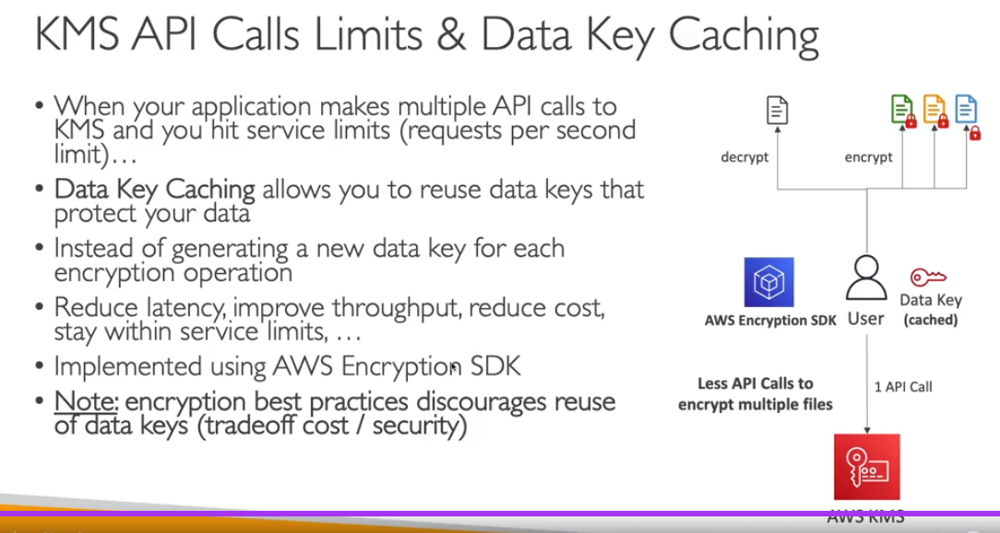

- KMS and EBS
    - You cannot change the KMS key for ebs but you can create snapshot and change the key while creating new ebs
    - there is account level setting you can enable each ebs will be encrytped by default
- KMS EFS
    - Encrypt the EFS
    - we have unencrypted efs we have to create new efs encrptey than we can use data sync to copy the data
- KMS ABAC
    - User will abel to encrypt and decrpt key if the user have same tag have in the KMS policy
- KMS Parameter Store
    - We can encrypt and decrypted in parameter store
    - Only symmetrics key used
