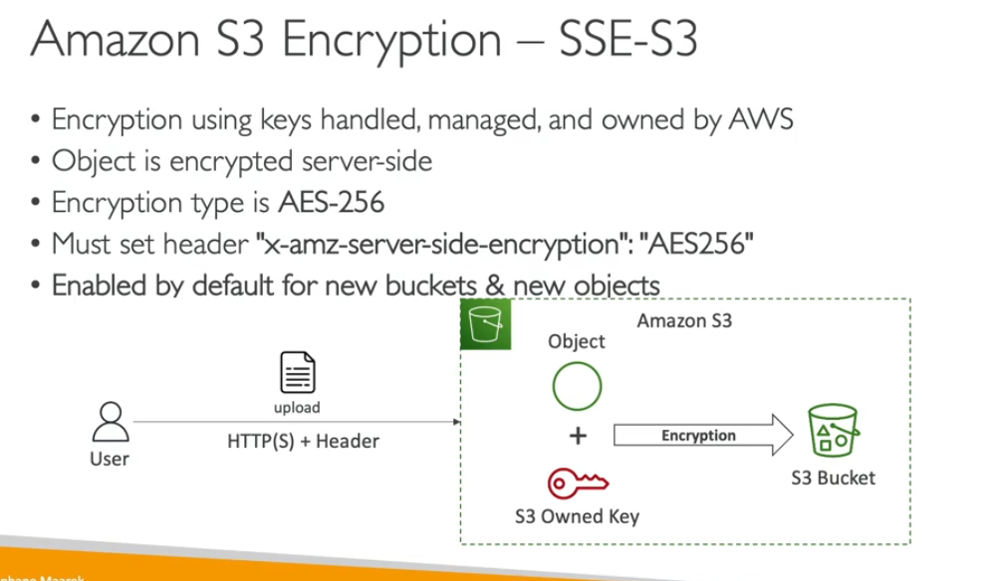
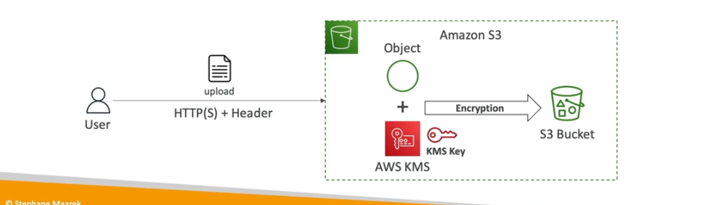
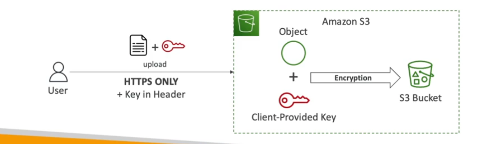
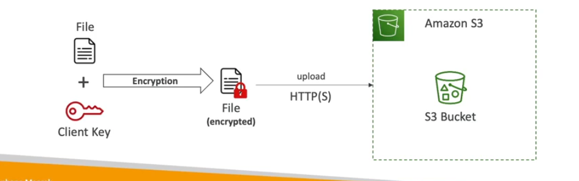
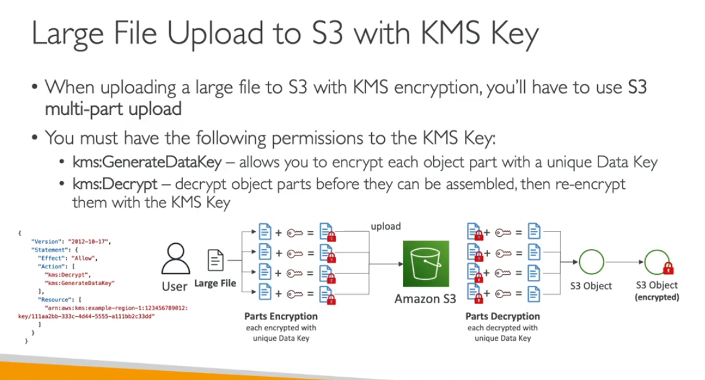
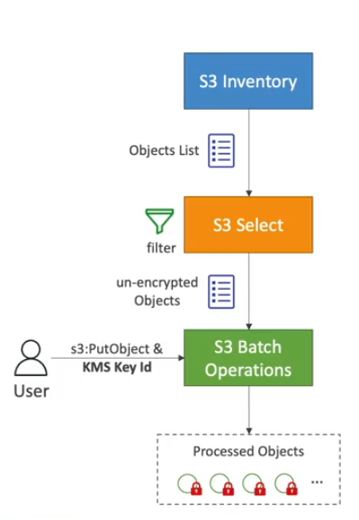
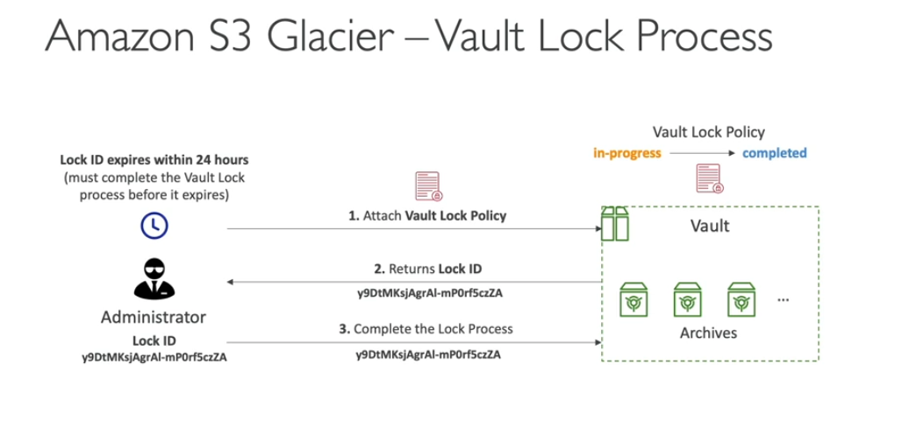

- Can encrypt the data to using KMS keys
- Following type
    - SSE-S3
    - SSE-KMS
    - SSE-C
        - you must use the https
    - Client side encryption
        - you can enrypt data outside aws and get data and decrypt
    - Force encryption in transit
        - You can add policy in s3 bucket to force them to only https aws:secreittransport=false

- S3 Encryption objects
    - objects are public encrypted they are not able to access
    - you need generatedatakey for large object
    - in glacier all data is encrypted

- S3 Default encryption
    - new objects store in buckets will be encrypted by default
    - you can restore to storee the object without encryption headers

Note: Buckets policy are evalued before the default encyption

- S3 Bucket Key for SSE-KMS encryption
    -  You can use data keys generated not calling again to KMS so it will limit the call save the cost.

- Large file to uplaod S3 with KMS key

- Encrypt unencrypted data using S3 batch operations

- S3 Glacier vault lock
    - Youc cannot modify and elete it
    - write once read many
    - block for specif object version to delete
    - Retention Mode - Compliance:
        - object version can't be overwritten or deleted by any user
        - object retention mode can be changed and retentaion period can't be changed
    - Retention Mode: Governance :
        - mos tuser can overwite
        - but some user given permission like admin
    - You want to project the object fixed period of time
    - Legal hold:
        - protect the object indenfly or idenpend from retention periiod
        - someone be freely place or remoe using s3:putleval objec permission

- S3 Glacier - vault policies & valutl lock
    - its like bucket policy
    - vault lock policy is a policy you lock, for regulatory and compliance requirements
    - the policy is immutable can't be changed (that;s why its call lock )
    -

- S3 Classes
    - move data using lifecycle policy
    - will help you decide transition thee objects for write class, analysis
- S3 Replication
    - CRR
        - low-latency CRR
    - SRR
        - test case to replicate the data
    - replication only works if enable the versions
    - only new objects are replication
    - s3 batch replication for existing object
    - no chaing of the replication 
