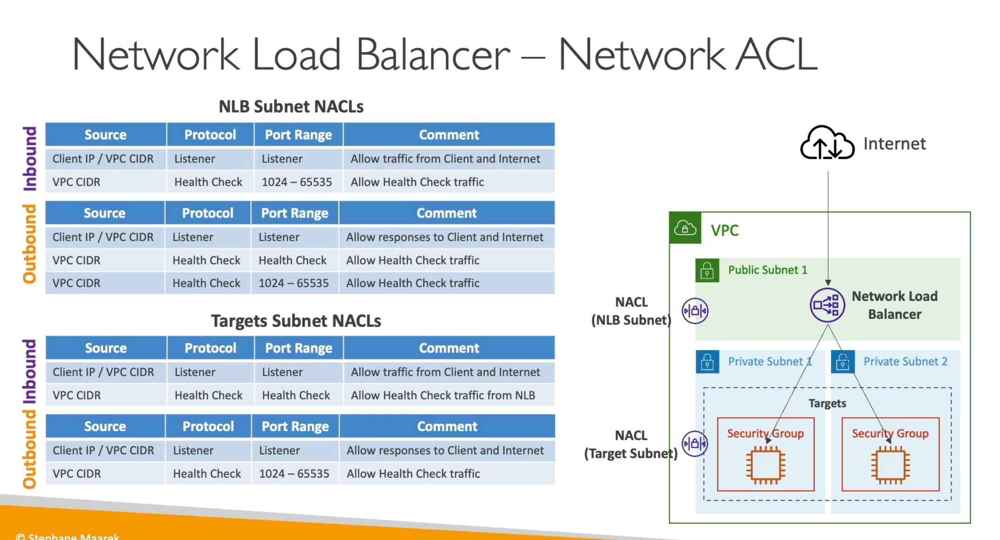

- Spread accoress multple resouces
- expose single point of access
- check the health check and point the traffic to specifc
- do regular health checks
- high avail cross region

- ALB
    - ELB by aws and managed by aws
    - HTTPS, HTTP, grpc its Layere 7 ALB
- NLB
    - layer 4, UDP, TCP
    - its static ip
    - its high requet to pcoress
    - its realy for high performance
    - handle million of requests
    - its only one static ip per availbility zone
    - its not inclue to aws free tier
    - NLB --> ALB -->? why nlb get fixed ip address and ALB manage all the rules
    - check TCP, Http, https protocol to check the health checks
    - Advanced
        - Client Ip-preservation: keep the client ip when enabled wh4en you need public ip of the client
        - if the this dissabled than you can get only network lb ip

- Gateway
    - its layer 4
    - route traffic to firewall
    - analysis the traffic coming, send to thir party also
    - traffic will send back to lb than sent to actually application
    - its inspect the ip packages

- Sticky Sessions
    - We can enable the to client send request to instance and always return by same client this is stickyness
    - this can be achive CLB, ALB, NLB,
    - user should not lose the session data
    - Cookies 2 types
        - Application base cookes
            - its custom cookies generate by the application
            - cookes must be specified by each target
            - you must not use the AWSLB, AWSALBAPP, AWSALBBTG
        - Dueation base
            - generated by lb
            - awslb, awslbapp

- SSL with ELB
    - you can mange SSL in acm
    - you can import
    - use 