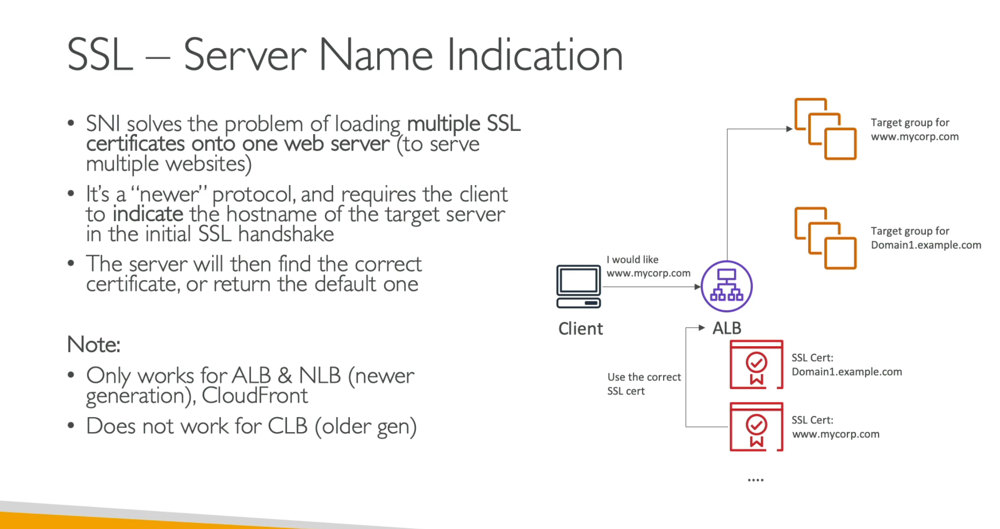
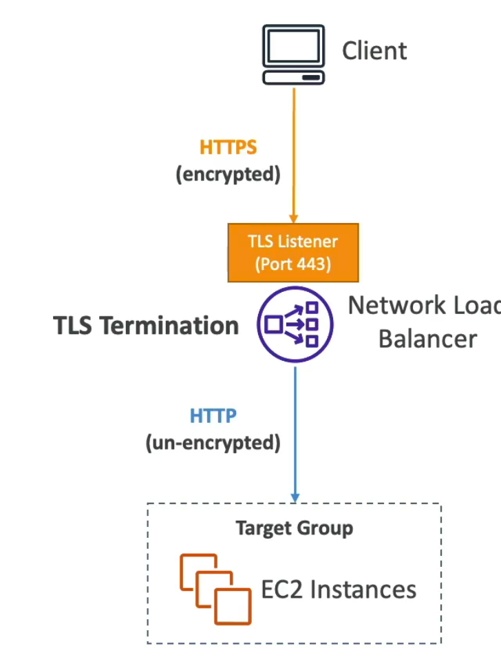
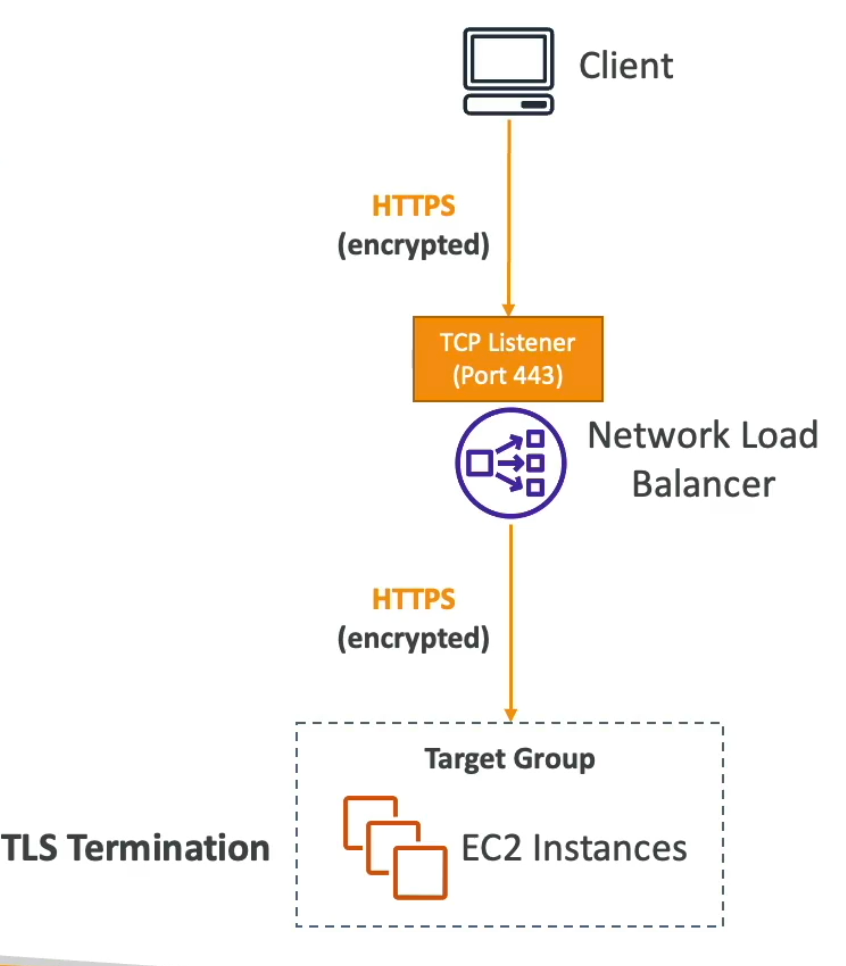

- SSL/TLS allow traffic between your client and server encrypat4d in transit
- SSL - secure socket layer
- TLS - transport layer secure

- SNI
    - how do you load multiple ssl certicate to server website
    - its only works ALB and NLB
    - doesnt work on CLB
    - you can define in ALB and use it
    - alb multiple listenser and multiple ssl certificate
    - routing base on the hostname

- Advanced
    - Security policy, you can use predefine the scureity policy Elb security policy
    - Unique sessuion key used for encypted the data, its policy forward-secrecy

- TLS with NLB
    - you must create certifte in ACm and attache to NLB
    - use in nlb

without mutual tls

with mutal tcp 
