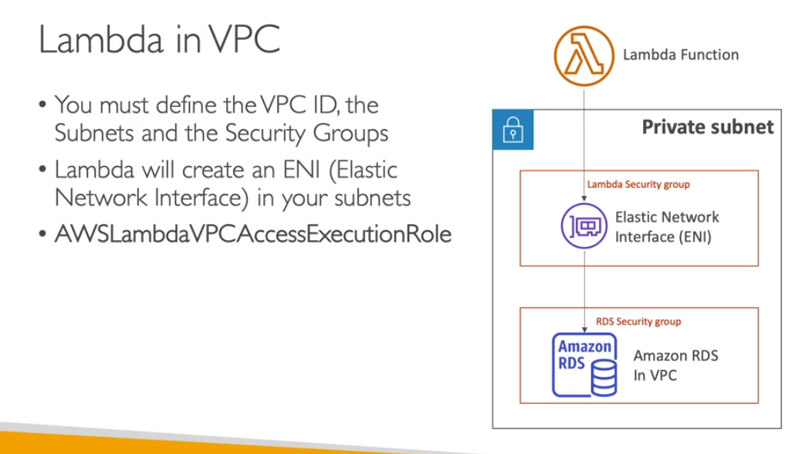
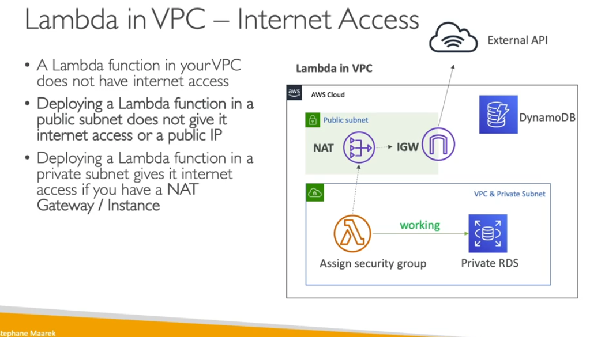

- Lambda exec role
- its upload logs to cloudwtch but you need role access tos end to logs
- when you deploy lambda function you need to understand what service going to use you need to privee the following role
- you can give resouces polcy to give access to other accounts
- like some service need to invoke the lambda function than need to provide permision in resouce group

- Lambda in VPC
    - by default lanch by outside your vpc
    - its cannot access yoru vpc
    - if you want lambda to your vpc you need to define the vpc and subnet and sgs
    - when you deploy lambda function in vpc doesnt have inteernet you need to private through NAT device

