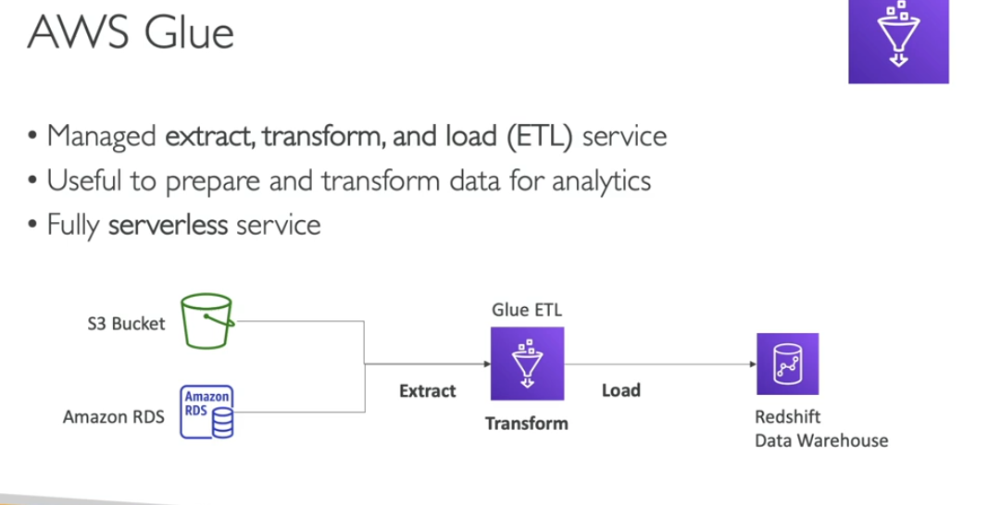
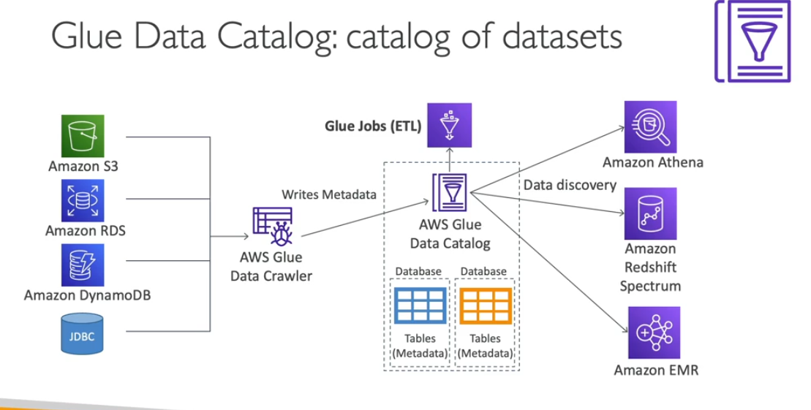

- Its serverless etl service
- you write code job and a

- how you can convert in parquet format
    - use glue etl service convert to parquet format
    - than amazon athena musch easily analyse it
    - you can trigger glue job by s3 envents notification
    - glue job bookmarks: prevent to reprocessing old data
    - Glue elastic view:
        - combine and replicatee data accreoss multiple data stores using sql
        - no custom code glue monitoring for the changes in the source data serverless
        - Leveragees a virtual table materialized view
    - Glue Databrew: clean and normalize data using prebuild transformation
    - glue studio : new gui to create urn jobs
    - glue streaming etl (build on apache spark structured stremm)
        compatible with KDS, kafka, MSK

- Glue Security
    - encryption at rest
    - encrypt using tls
    - identy base policy
    - resource base policy
    - we can have centrolize data catalog
    - 