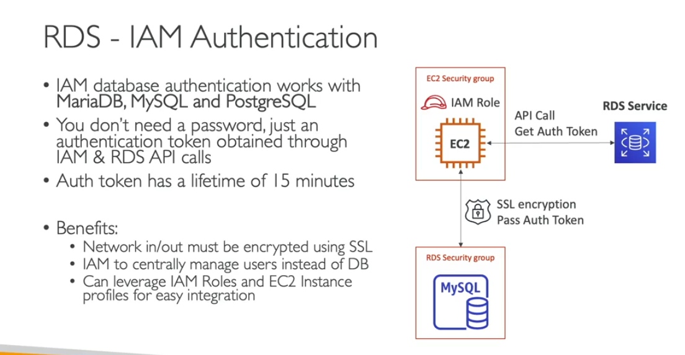
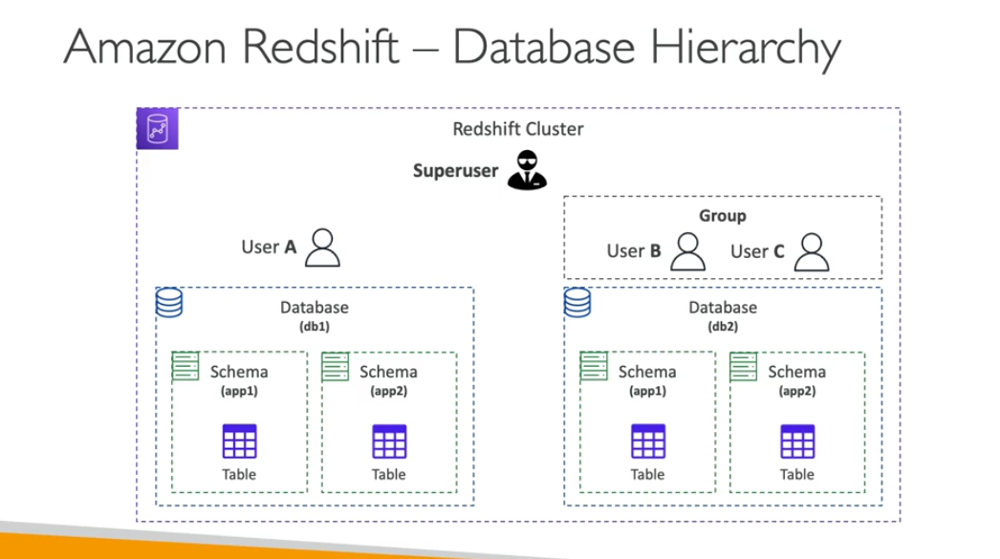

- ASG
    - instance refresh feature
    - we call the startinstancefresh api and set minimum healthy nodes
    - we can specfic the warmup time

- EBS - Data volumme Wiping
    - if the ebs delete after aws replace with 0000 than it can assing to other custoemr

- Cloudshell
    - its brower base cli you can run the commands
    - it has all the cli whatever you need
    - its preconfiged aws credentails
    - you have persistance store
    - you are running amazon ami
    - you can't access within vpc
    - you need to use ec2 instance connect

- RDS & Aurora Security
    - at rest encryption
    - In fliths encryption
    - IAM authencitcation
    - security groups
    - no ssh
    - audit logs send to cloudwatch
    - IAM Authentication
        - IAM database authentication works with mariadb, mysql, and postgreSQL
        - you don;t need password just an authentication token obtained through IAM & RDS API
        - auth token have life time of 15 mins
    - we can encrypt the rds by take snapshot of unencrypted than restore to encypted rds

- EC2 Image builder
    - its use to automte create of virtual machine and container images
    - its automate the create if the ec2 amis
    - we can schedule it create new amis

- EC2 Image builder troubleshooting
    - if there is access denied for s3 you need check the permission

- Redshitf Security
    - Superusers: it have same permission as db administrator
    - user can created by superusers
    - you can login using image roles in database
    -

- DynamoDB - TTL (time to live)
    - automatically delete item from db
    - whenever current time
    - expired item deleted within 48 hours
    - 