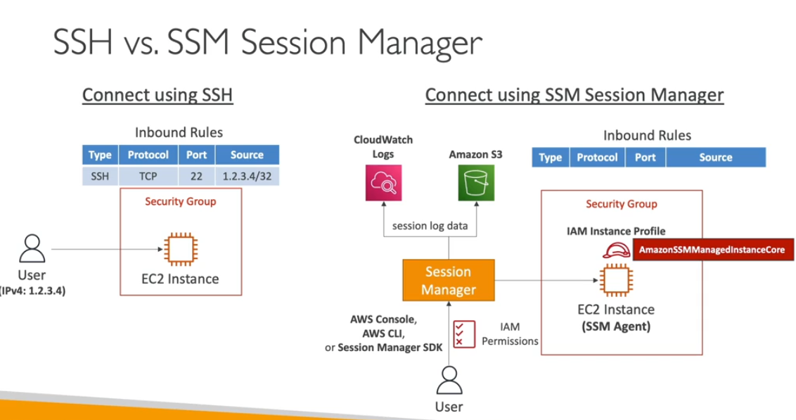

- Secure shell envirmeent in your ec2 instance
- you don't need directly ssh on ec2
- access throught aws console , cli , seession sdk
- support linux, macos, and windows
- session log data can be sent to s3 or cloudwatch
- idea is to securee login
- IAM permission to allow which user can access
- if you deep down secureity to retrict the command level
- you need ssm agent, iam role and user who have permssion
- this can be helpful for security purpose 

