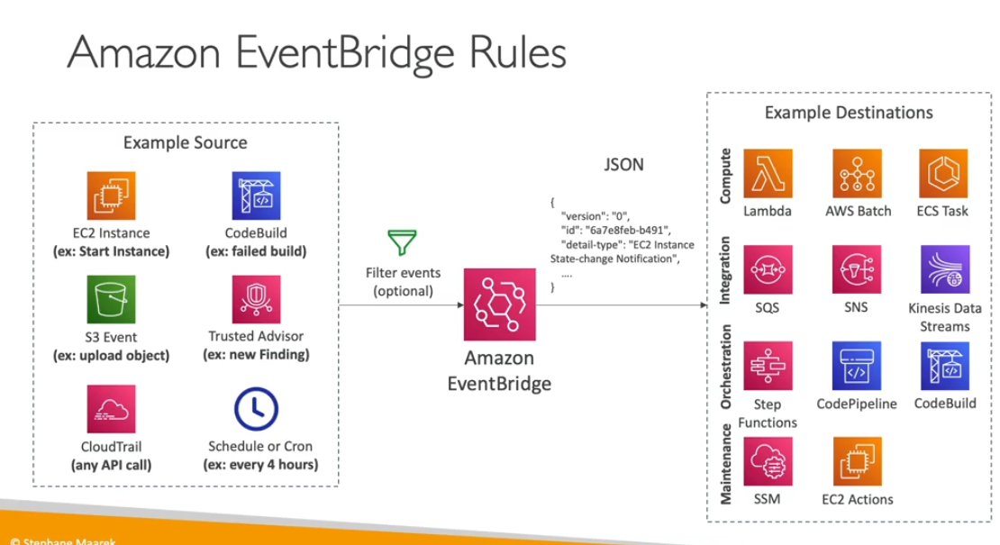

Amazon Event bridget

- Cloudwatch events become the eventbridge 
- schedule th eevents
- you can trigger base on the evetns
- there are many source to receive events from different
- you can trigger lambda function or others
- you can archie the events
- you can reply the archieve events

- Schema Registry
    - Analyse the json formation and allow to download code base on your schema
    - schema can be version

- Resouce-based Policy
    - We can allow other events bus to allow send events
    - like we have centrol events bus

