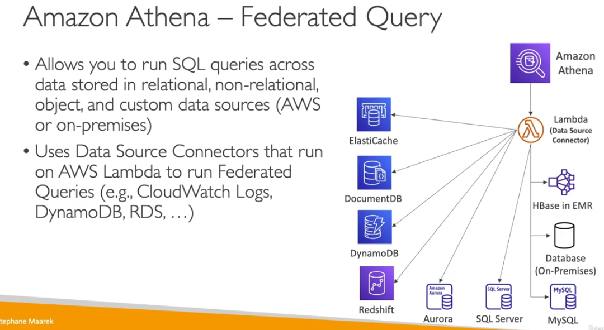

Amazon Athena

- serverless sql athena engine
- analysie directly your data in s3 bucket
- you going to pay fix amount of scan
- use cases, adhoc queries, cloutrails logs,
- improte the performace use columnar data
    - Apache Parquet or ORC
    - Glue can help you convert data in csv to partquet
    - compress data in smaller size like gzip other compression
    - partition the data in columner
    - use bigger files, smaller files are not good performace
- Federated query
    - You can query other serices like other data sources
    -

- Troubleshooting Athena
    - check s3 access
    - check s3 encryption or allow the service to use encryption to use it 