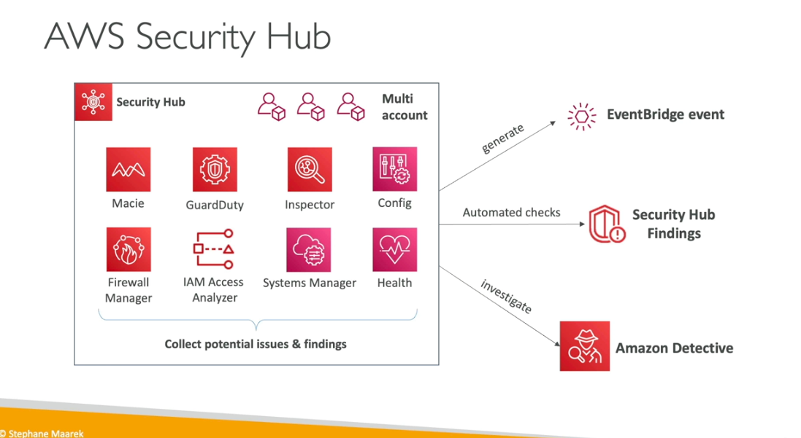
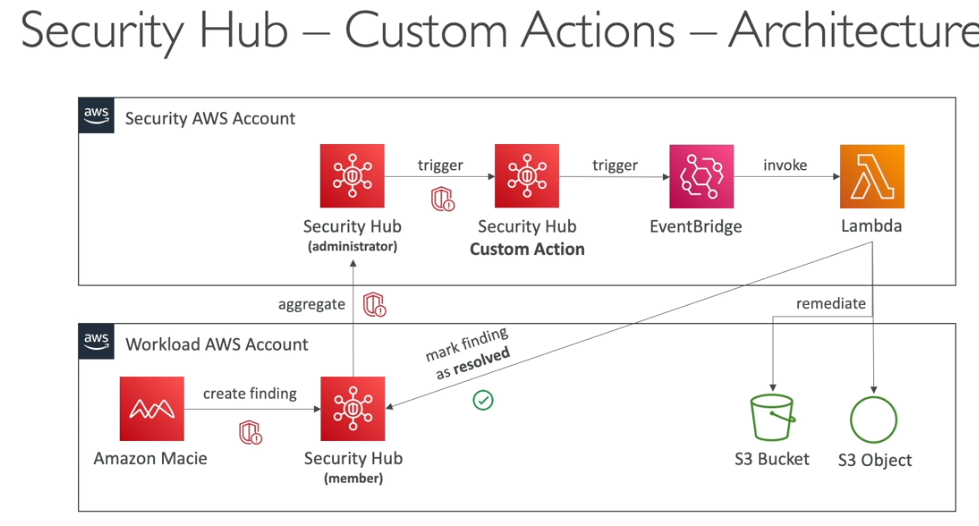
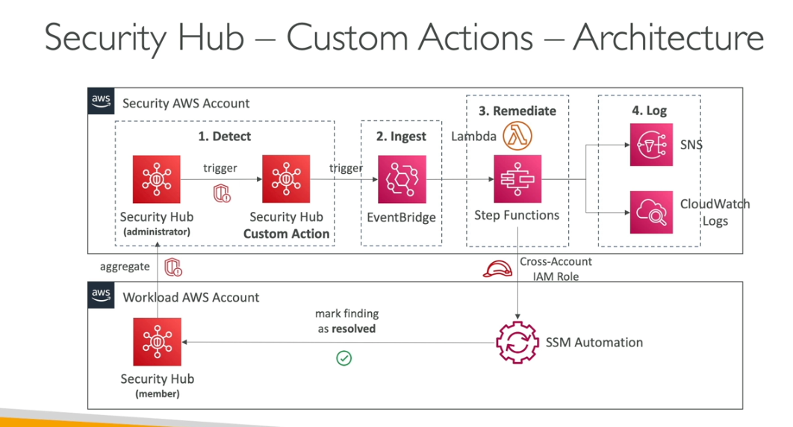

AWS Security Hub

Centrol security tool to manage security accrosss serveral aws accounts and automate security checks

- Aggregates all the alerts in predefine or personal findigns fromat from various aws service & aws partner tools
    - Config
    - GuardDuty
    - Macie
    - IAM access analyzer
    - AWS system manager
    - AWS firewall manager
    - AWS health
    - AWS partner network
- must first enable aws config service

Advanced Concepts

- Cross region aggregation possbiel one reegion to another region
- Org integraion one centrol account
- one of th memeber account can be security hub
- aws config be enabled
-  should enabel for all the accounts
- make sure all memebers account enables
- it has standard CIS aws PCI, DSS

Security hub with guradduty

- automatically enable with guardduty
- sending finers to security hub
- any unauthrise access to
- convert the aws Aws security finding formation (|ASFF)
- archivein guardduty will not be in security hub

Services Integraion

- alot of other services send findgs to securyt hub
- deal with these findings
- audit manger
- chatbot
- detective
- trust advisor

Security hub with 3rd party
- sending findigns secuirty hub
- receive findings from security hub
- update findings in security hub
- these are in ASFF format

- findings delete after 90 days

- insights
    - collection of related findings that identifies a security area that requires attentions and intervention
    - like ec2 having public access accross all ec2
    - you can define custom insights to track
    - automation: eventbridge remidiation possible

