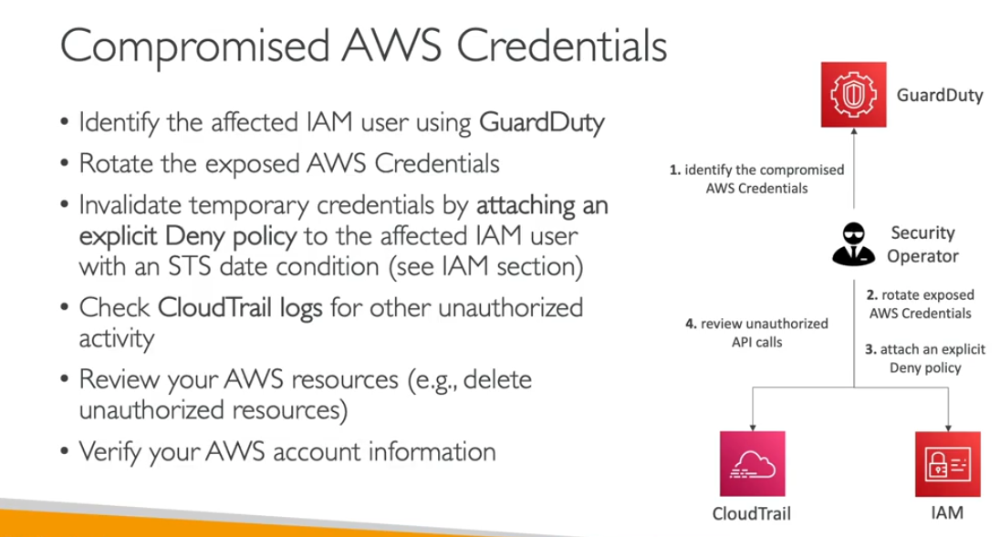

- user has benn compromised
- rotate the expose credendtials
- you need invalidatee the deny all policy
- check cloudd trail logs what things are happen using this user
-always check your aws information maybe it has beeen changed.

IAM role comproise
- identity which role
- attach the deny policy
- check cloud trail
- review the it
- check out accoutn infrmation

Compromise the account

- delete and create again aws keys
- delte all pem keys
- delete unauthroise resouces
- check your aws information

