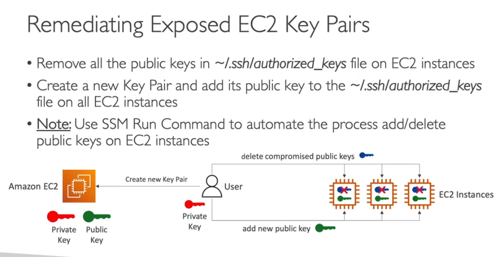

- private key download automatically create on your makchine
- amazone keep the public
- root ebs volumns of
- private key must be secure
- you can createe outside privatee key outside aws
- if the ami use that use key1 but you create new ec2 with keey2 than it will have two keys
- you can automate the keys update using SSM run command to automate the process add and delete public keys on ec2 instances

