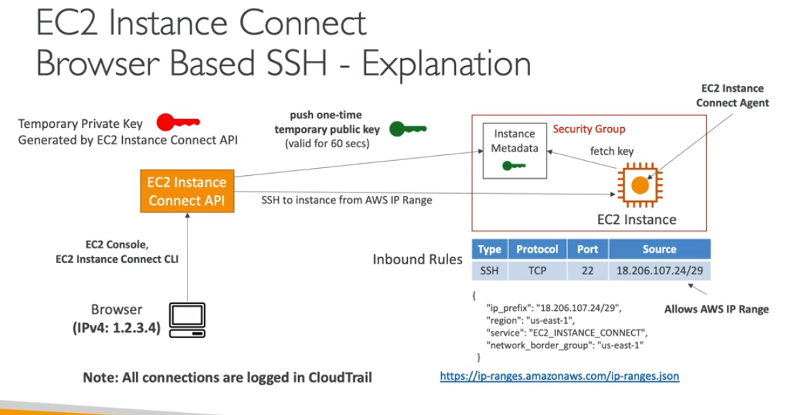

- Instance conncect create key pari and push public key to instance metadata
- when ssh to ec2 the ssh service look for instance meta data service for the keys
- its foudn the key and allow to login
- all this happening by only connect agent
- only aws can generate the keys
- in sg we need to allow the security group for the aws public ips

