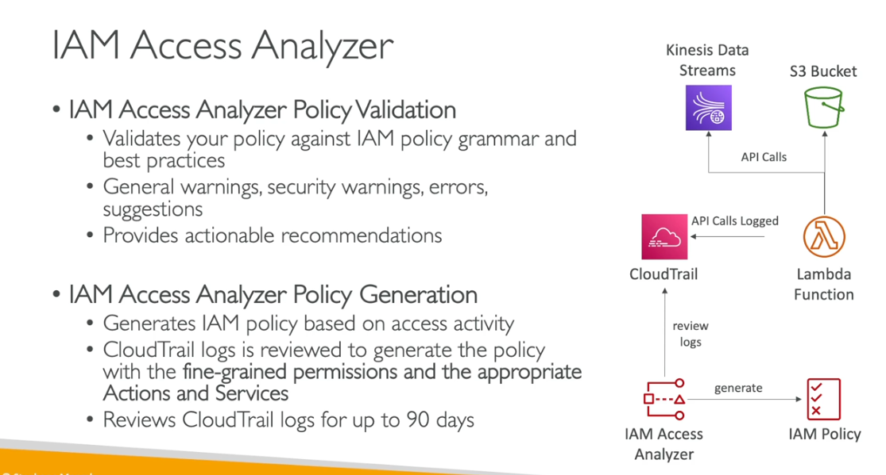

- Finds out which resouces are shared outside aws
- IAM rols
- s3
- keys
- lambda function
- sqs
- secreets manager

- You can do policy validation
- you can get waring errors
- you can create your policy

